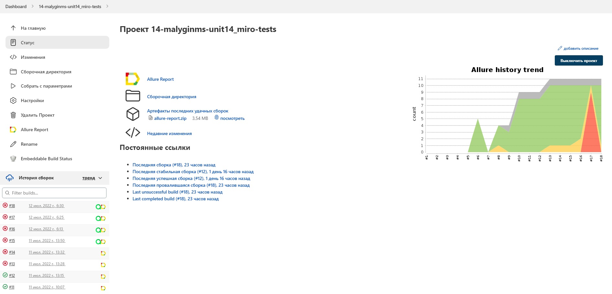
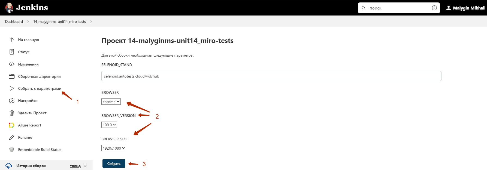
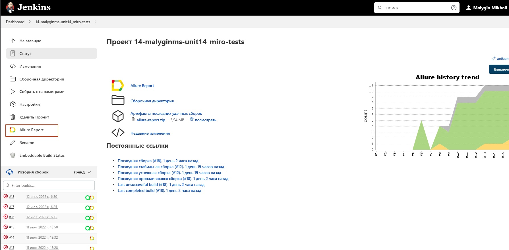
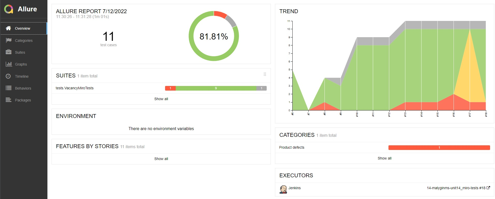

# UI tests for miro web pages
> <a target="_blank" href="https://miro.com/">Link to miro web page</a>
 


## :page_with_curl: Table of contents:
- [Technology stack](#Technology-stack)
- [Test cases](#Test-cases)
- [Deploy in Jenkins](#Deploy-in-Jenkins)
- [Run test using terminal](#Run-tests-using-terminal)
- [Reports in Allure](#Reports-in-Allure)
- [Reports in Allure TestOps](#Reports-in-Allure-TestOps)
- [Test video](#Test-video)
- [Jira synchronization](#Jira-synchronization)
- [Notification in telegram](#Notification-in-telegram)

## Technology stack
<p align="center">
<a href="https://www.java.com/"></a>
<a href="https://github.com/"></a>
<a href="https://www.jetbrains.com/idea/"></a>
<a href="https://gradle.org/"></a>
<a href="https://selenide.org/"></a>
<a href="https://junit.org/junit5/"></a>
<a href="https://aerokube.com/selenoid/"></a>
<a href="https://www.jenkins.io/"></a>
<a href="https://github.com/allure-framework/allure2"></a>
<a href="https://qameta.io/"></a>
<a href="https://www.atlassian.com/software/jira"></a>
<a href="https://telegram.org/"></a>
</p>

## Test cases
- :heavy_check_mark: Open a main page of Miro
- :white_circle: Open a signup page of Miro
- :heavy_check_mark: Fill in a signup form without password and check validation error "Enter your password"
- :heavy_check_mark: Open a careers page of Miro
- :heavy_check_mark: Search a vacancy on careers page
- :heavy_check_mark: Open a vacancy page
- :x: Fill in a vacancy form without CV and check validation error "resume/CV is required"

## Deploy in Jenkins
> <a target="_blank" href="https://jenkins.autotests.cloud/job/14-malyginms-unit14_miro-tests/">Build in Jenkins</a>



#### Build parameters
- Selenoid stand (remote stand which is used for test runs)
- browser (browser in which tests run, by default chrome)
- browserVersion (browser version in which tests run, by default 100.0)
- browserSize (browser window size in which tests run, by default 1920)



## Run tests using terminal

#### Command for local run:
```bash
gradle clean test
```

#### Command for remote run:
```bash
clean test
-DselenoidStand=${SELENOID_STAND}
-DbrowserSize=${BROWSER_SIZE}
-Dbrowser=${BROWSER}
-DbrowserVersion=${BROWSER_VERSION}
```

## Reports in Allure
> <a target="_blank" href="https://jenkins.autotests.cloud/job/14-malyginms-unit14_miro-tests/18/allure/#">Link to Allure reports</a>



#### Overview dashboard

<p align="center">

</p>

## Reports in Allure TestOps

## Test video

## Jira synchronization

## Notification in telegram