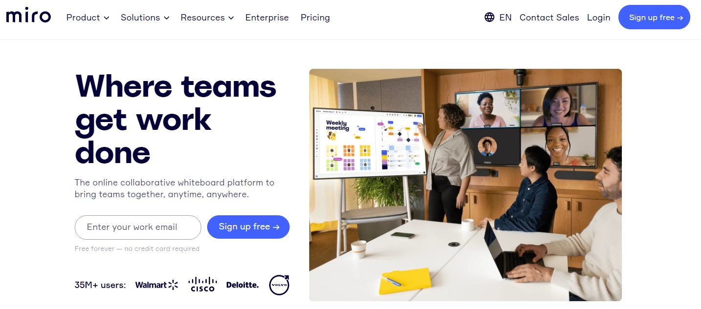
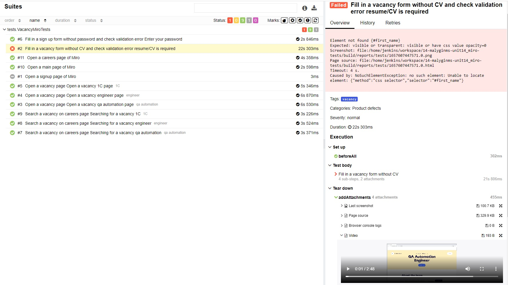
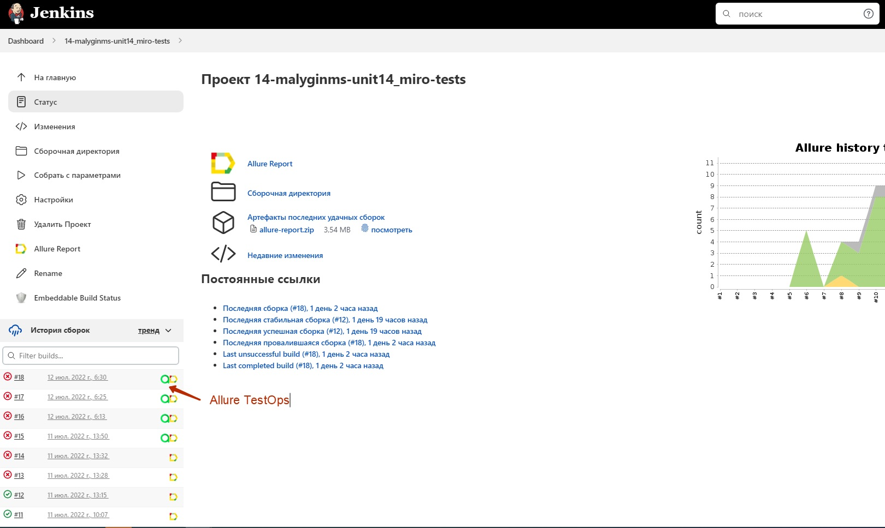
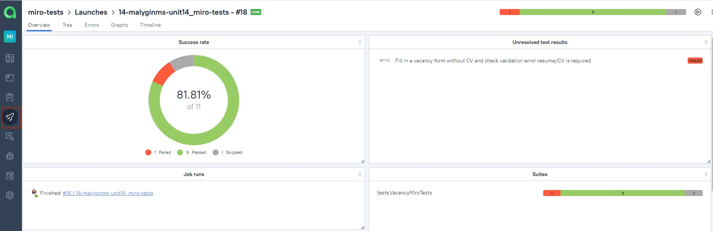
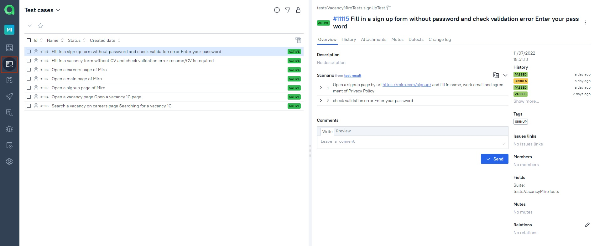
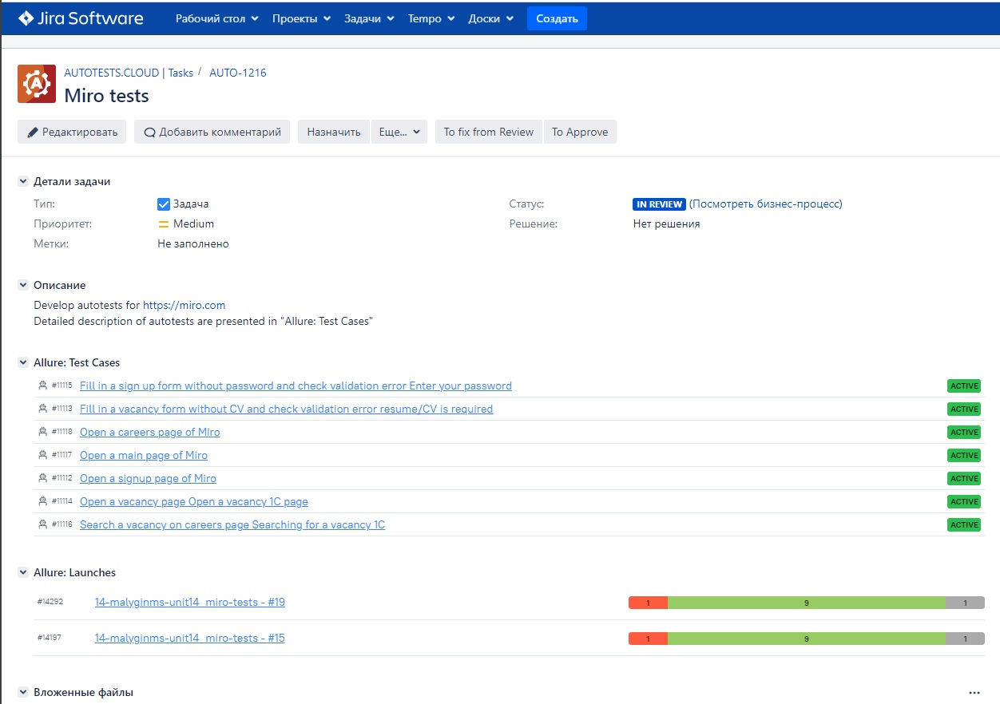
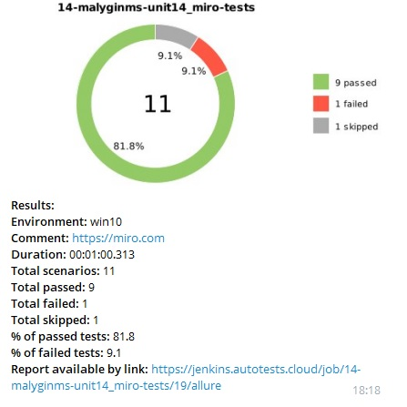

# UI tests miro web pages
> <a target="_blank" href="https://miro.com/">Link to miro web page</a>
 


## :page_with_curl: Table of contents:
- [Technology stack](#computer-technology-stack)
- [Test cases](#bookmark_tabs-test-cases)
- [Deployment in Jenkins](#-deployment-in-Jenkins)
- [Running tests using terminal](#desktop_computer-running-tests-using-terminal)
- [Allure reports](#-allure-reports)
- [Allure TestOps integration](#-allure-TestOps-integration)
- [Testing video](#clapper-testing-video)
- [Jira integration](#-jira-integration)
- [Notification in telegram](#-notification-in-telegram)

## :computer: Technology stack
<p align="center">
<a href="https://www.java.com/"></a>
<a href="https://github.com/"></a>
<a href="https://www.jetbrains.com/idea/"></a>
<a href="https://gradle.org/"></a>
<a href="https://selenide.org/"></a>
<a href="https://junit.org/junit5/"></a>
<a href="https://aerokube.com/selenoid/"></a>
<a href="https://www.jenkins.io/"></a>
<a href="https://github.com/allure-framework/allure2"></a>
<a href="https://qameta.io/"></a>
<a href="https://www.atlassian.com/software/jira"></a>
<a href="https://telegram.org/"></a>
</p>

## :bookmark_tabs: Test cases
- :heavy_check_mark: Open a main page of Miro
- :white_circle: Open a signup page of Miro
- :heavy_check_mark: Fill in a signup form without password and check validation error "Enter your password"
- :heavy_check_mark: Open a careers page of Miro
- :heavy_check_mark: Search a vacancy on the careers page
- :heavy_check_mark: Open a vacancy page
- :x: Fill in a vacancy form without CV and check validation error "resume/CV is required"

##  Deployment in Jenkins
> <a target="_blank" href="https://jenkins.autotests.cloud/job/14-malyginms-unit14_miro-tests/">Build in Jenkins</a>


#### Build parameters
- Selenoid stand (remote stand which is used for test runs)
- browser (browser in which tests run, by default chrome)
- browserVersion (browser version in which tests run, by default 100.0)
- browserSize (browser window size in which tests run, by default 1920)


## :desktop_computer: Running tests using terminal

#### Command for local run:
```bash
gradle clean test
```

#### Command for remote run:
```bash
clean test
-DselenoidStand=${SELENOID_STAND}
-DbrowserSize=${BROWSER_SIZE}
-Dbrowser=${BROWSER}
-DbrowserVersion=${BROWSER_VERSION}
```

##  Allure reports
> <a target="_blank" href="https://jenkins.autotests.cloud/job/14-malyginms-unit14_miro-tests/18/allure/#">Link to Allure reports</a>


#### Overview dashboard

<p align="center">

</p>

#### Suites dashboard 
You can find detailed description of tests and attachments(screenshots, logs, videos) which will be useful for debugging, test documentations, etc

<p align="center">

</p>

#### Graphs dashboard

<p align="center">

</p>

##  Allure TestOps integration
> <a target="_blank" href="https://allure.autotests.cloud/launch/14217">Link to Allure TestOps</a>



#### Launches dashboard

<p align="center">

</p>

#### Test cases dashboard

<p align="center">

</p>

## :clapper: Testing video

https://user-images.githubusercontent.com/68316516/178743616-3d6e2e4a-ca29-48a2-b9aa-f54956871810.mp4

##  Jira integration
> <a target="_blank" href="https://jira.autotests.cloud/browse/AUTO-1216">Link to Jira task</a>



##  Notification in telegram

